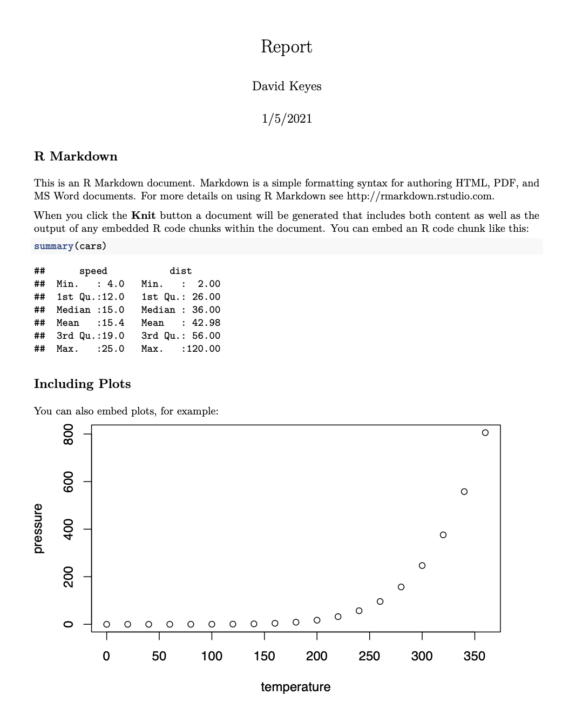

```{r openMic, include = FALSE}
# openMic::openMic()
```

```{r xaringan-animate-css, echo=FALSE}
xaringanExtra::use_animate_css()
```

```{r xaringan-extra-styles, echo = FALSE}
xaringanExtra::use_extra_styles(
  hover_code_line = TRUE,         #<<
  mute_unhighlighted_code = TRUE  #<<
)
```


class: white-bg animated fadeIn fadeOut
# A Quick Story

---

background-image: url("images/rmd-pdf.png")
class: animated fadeIn fadeOut

.alt-text-bottom-right[Alt text: Default PDF Format Rendered from RMarkdown]

---

background-image: url("images/rmd-pdf.png")
class: white-bg animated fadeIn fadeOut text-bottom

.alt-text-bottom-right[Alt text: Default PDF Format Rendered from RMarkdown]

## Recognize This?



.alt-text-bottom-right[Alt text: Default PDF Format Rendered from RMarkdown]

---

class: white-bg animated fadeIn fadeOut
## R Users Are Not Designers

---


background-image:url("https://media.giphy.com/media/AC1HrkBir3bGg/source.gif")
background-size: cover
class: animated fadeIn fadeOut text-bottom

.alt-text-bottom-right[Alt text: Woman pointing to her head and saying "DUH!"]

---

background-image: url("images/who-runs-the-world.gif")
background-size: cover
class: animated fadeIn fadeOut text-bottom

.alt-text-bottom-right[Alt text: Michelle Obama and friends saying "Who runs the world?"]
---

background-image: url("images/who-runs-the-world.gif")
background-size: cover
class: animated fadeIn fadeOut text-bottom
## PDFs Run the World

.alt-text-top-right[Alt text: Michelle Obama and friends saying "Who runs the world?"]

---

background-image: url("https://www.workfront.com/sites/default/files/imported/400867961-11778.jpg")
background-size: cover
class: animated fadeIn fadeOut text-bottom
## Yeah, I'm Gonna<br>Need That in a PDF

.alt-text-bottom-right[Alt text: Boss from Office Space]

---

background-image: url("images/road-split.jpg")
class: animated fadeIn fadeOut
## Options to<br>Make PDF Reports

.alt-text-bottom-right[Alt text: Road splitting in two directions]

---


class: white-bg animated fadeIn fadeOut
background-image: url("images/rmd-pdf.png")
## Option #1<br>Default PDF Format

.alt-text-bottom-right[Alt text: Default PDF Format Rendered from RMarkdown]

---


class: white-bg animated fadeIn fadeOut
### Please Don't

---

class: animated fadeIn fadeOut white-bg
## Option #2<br>LaTeX

---

class: animated fadeIn fadeOut
background-image: url("images/latex-sucks-1.png")

.alt-text-bottom-right[Alt text: Tweets of people complaining about LaTex]

---

class: animated fadeIn fadeOut
background-image: url("images/latex-sucks-2.png")

.alt-text-bottom-right[Alt text: Tweets of people complaining about LaTex]

---

class: animated fadeIn fadeOut
background-image: url("images/latex-sucks-3.png")

.alt-text-bottom-right[Alt text: Tweets of people complaining about LaTex]

---

class: animated fadeIn fadeOut
background-image: url("images/latex-sucks-4.png")

.alt-text-bottom-right[Alt text: Tweets of people complaining about LaTex]

---

class: animated fadeIn fadeOut
background-image: url("images/latex-sucks-5.png")

.alt-text-bottom-right[Alt text: Tweets of people complaining about LaTex]


---


class: animated fadeIn fadeOut
background-image: url("images/graphic-designer.jpg")
## Option #3<br>Work With a Designer

.alt-text-bottom-right[Alt text: Computer screens with nicely laid out reports]

---

class: animated fadeIn fadeOut right
background-image: url("images/thinking.jpg")
## Is There<br>Another Option?

.alt-text-bottom-right[Alt text: Gorilla thinking deeply]


---

class: white-bg animated fadeIn fadeOut
# Yes!

---

background-image: url("images/rmd-pdf.png")
class: white-bg animated fadeIn fadeOut
# How Did I Get From Here ... 

.alt-text-bottom-right[Alt text: Default PDF Format Rendered from RMarkdown]

---

background-image: url("images/psc-sample.png")
class: white-bg animated fadeIn fadeOut
## ... To Here?

.alt-text-bottom-right[Alt text: Sample from report on housing data in Connecticut]

---

background-image: url("images/ct-towns.gif")
background-size: cover
class: animated fadeIn fadeOut

.alt-text-bottom-right[Alt text: Animation of map of Connecticut, with all towns appearing one after the other]
## Client Needs 170+ Reports


---

background-image: url("images/frustrated.jpg")
class: white-bg animated fadeIn fadeOut text-bottom
## Enough to Drive You Crazy

.alt-text-bottom-right[Alt text: Woman holding her head in her hands]

---

background-image: url("images/parameterized-reporting-article.png")
class: white-bg animated fadeIn fadeOut
## R is Efficient ... 

.alt-text-top-right[Alt text: Screenshot of article about parameterized reporting]

---

background-image: url("images/beautiful-lake.jpg")
class: animated fadeIn fadeOut text-bottom
## ... But Can it Be Beautiful?

.alt-text-bottom-right[Alt text: Beautiful lake with mountains surrounding it]


---

background-image: url("images/pagedown-resume.png")
class: white-bg animated fadeIn fadeOut
# Enter `pagedown`

.alt-text-bottom-right[Alt text: Screenshot of resume made with pagedown package]

---

background-image: url("images/psc-sample.png")
class: white-bg animated fadeIn fadeOut
## Connecticut<br>Housing Reports

.alt-text-bottom-right[Alt text: Sample from report on housing data in Connecticut]

---

class: white-bg animated fadeIn fadeOut
## R Code for the Plots

---

background-image: url("images/plot-code.png")
background-size: cover
class: white-bg animated fadeIn fadeOut

.alt-text-bottom-right[Alt text: Sample of code used to make plot in housing data report]

---

class: white-bg animated fadeIn fadeOut middle

## HTML and CSS<br>for the Layout

---

background-image: url("images/psc-layout-code.png")
background-size: contain
class: white-bg animated fadeIn fadeOut

.alt-text-bottom-right[Alt text: Sample of code to lay out plots in housing data report]

---

background-image: url("images/psc-layout-sample.png")
background-size: contain
class: white-bg animated fadeIn fadeOut text-bottom 
## The Result

.alt-text-bottom-right[Alt text: Sample from housing data report with plot next to text]

---

background-image: url("images/psc-code.png")
class: white-bg animated fadeIn fadeOut
## Here's the Thing:<br>It's Complicated

.alt-text-bottom-right[Alt text: Sample of code used to make housing data report]


---

background-image: url("images/class.jpg")
class: animated fadeIn fadeOut text-bottom
## I Tried Teaching Others

.alt-text-top-right[Alt text: Kids in class huddled around a computer]

---

background-image: url("images/confused.jpg")
class: animated fadeIn fadeOut text-bottom right
## It Didn't<br>Go Well

.alt-text-bottom-right[Alt text: Woman with a confused look on her face]

---

background-image: url("images/beautiful-lake.jpg")
class: animated fadeIn fadeOut text-bottom
## Can We Make<br>Something Beautiful ...

.alt-text-bottom-right[Alt text: Beautiful lake with mountains surrounding it]

---

background-image: url("images/easy-to-use.jpg")
class: animated fadeIn fadeOut text-bottom
## ... and Easy to Use? 

.alt-text-bottom-right[Alt text: Person standing on rock with arms outstretched]

---

class: white-bg animated fadeIn fadeOut
# Enter `pagedreport`

---

class: white-bg animated fadeIn fadeOut
## Windmill

.right[

]

.alt-text-bottom-right[Alt text: Animation of pages from pagedreport template]

---

class: white-bg animated fadeIn fadeOut
## Grid

.right[

]

.alt-text-bottom-right[Alt text: Animation of pages from pagedreport template]

---

class: white-bg animated fadeIn fadeOut
## Hazelnuts

.right[

]

.alt-text-bottom-right[Alt text: Animation of pages from pagedreport template]

---

background-image: url("images/hole.jpg")
class: animated fadeIn fadeOut text-bottom
## It's YAML All the Way Down

.alt-text-top-right[Alt text: Deep hole with water in it]

---

class: middle


```{yaml echo = TRUE}
---
title: "Title of the report"
subtitle: "Subtitle of the report"
author: "Author Name"
date: "Date"
output: 
  pagedreport::paged_windmill:
    logo: "https://mk0rfortheresto0o08q.kinstacdn.com/wp-content/uploads/2020/08/rru-logo-blue.svg"
    img_to_dark: FALSE
    logo_to_white: TRUE
knit: pagedown::chrome_print
main-color: "#6cabdd"
---
```

???


title: "Title of the report"
subtitle: "Subtitle of the report"
author: "Author Name"
date: "Date"
output: 
  pagedreport::paged_windmill:
    logo: "https://mk0rfortheresto0o08q.kinstacdn.com/wp-content/uploads/2020/08/rru-logo-blue.svg"
    # logo: "https://upload.wikimedia.org/wikipedia/commons/c/ce/Coca-Cola_logo.svg"
    img_to_dark: FALSE
    logo_to_white: FALSE
knit: pagedown::chrome_print
main-color: "#6cabdd"
# main-color: "#e61a27"


---

background-image: url("images/rmd-pdf.png")
class: white-bg animated fadeIn fadeOut
# Please,<br>Don't Make Ugly PDFs

.alt-text-bottom-right[Alt text: Default PDF Format Rendered from RMarkdown]

---

class: white-bg animated fadeIn fadeOut
## Got HTML + CSS Skills<br>and Want 100% Control?<br>Try `pagedown`

---

background-image: url("https://mk0rfortheresto0o08q.kinstacdn.com/wp-content/uploads/2021/01/windmill.gif")
background-size: cover
class: white-bg animated fadeIn fadeOut
## Want A Simple Way<br>to Make Beautiful<br>PDF Reports?<br>Try `pagedreport`

.alt-text-bottom-right[Alt text: Animation of pages from pagedreport template]


---

class: text-bottom white-bg animated fadeIn fadeOut

# Learn More

`pagedown`: [pagedown.rbind.io](pagedown.rbind.io)

`pagedreport`: [pagedreport.rfortherestofus.com](pagedown.rbind.io)

.alt-text[Test footer]

---

class: white-bg animated fadeIn fadeOut middle text-bottom

# Questions?<br>david@rfortherestofus.com


.alt-text-top-right[Alt text: Headshot of David Keyes]